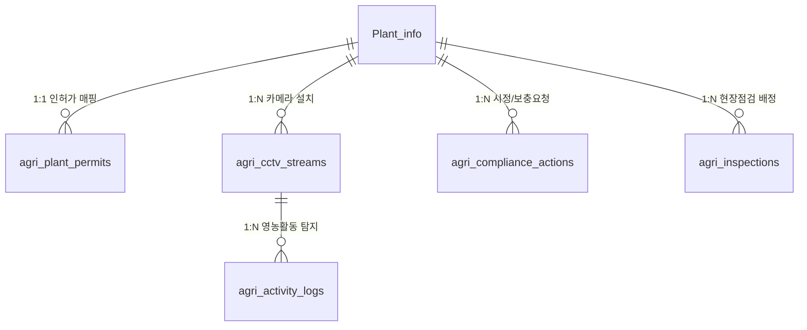

# 📊 [문서 02] MRT_DB 테이블 설계 및 데이터 매핑 명세서

> **문서 버전**: v2.0 (2026.08.24)  
> **출처 명세**: `MRT_DB 현황 .xlsx` (테이블 속성, 테이블 관계표, 테이블 및 칼럼 정리)  
> **대상 독자**: DB 관리자, 백엔드 개발자, 데이터 엔지니어, 플랫폼 운영자

---

## 📑 목차 (Table of Contents)

1. [DB 테이블 구조 및 속성 개요](#1-db-테이블-구조-및-속성-개요)
2. [세부 테이블 및 칼럼 정의](#2-세부-테이블-및-칼럼-정의)
   - [2.1. `Plant_info` (발전소 기본정보 및 통신 설정)](#21-plant_info-발전소-기본정보-및-통신-설정)
   - [2.2. `Iv_list` (인버터 목록 및 통신 파라미터)](#22-iv_list-인버터-목록-및-통신-파라미터)
   - [2.3. `Iv_real_data` (인버터 실시간 계측 데이터)](#23-iv_real_data-인버터-실시간-계측-데이터)
   - [2.4. `EV_list` (환경센서 장비 목록)](#24-ev_list-환경센서-장비-목록)
   - [2.5. `EvSensor_real_data` (환경/기상 센서 계측 데이터)](#25-evsensor_real_data-환경기상-센서-계측-데이터)
   - [2.6. `relay_list` & `relay_control_settings` (릴레이 제어 및 자동화)](#26-relay_list--relay_control_settings-릴레이-제어-및-자동화)
   - [2.7. `iv_energy_state`, `device_daily_data`, `device_monthly_data` (발전량 집계)](#27-iv_energy_state-device_daily_data-device_monthly_data-발전량-집계)
   - [2.8. `Total_ErrorHistory` (장애 및 알람 이력)](#28-total_errorhistory-장애-및-알람-이력)
3. [실시간 자동 금융 정산 및 환경(CO₂) 연산 엔진](#3-실시간-자동-금융-정산-및-환경co₂-연산-엔진)
4. [MRT_DB ↔ 관제 플랫폼 UI 매핑 매트릭스](#4-mrt_db-↔-관제-플랫폼-ui-매핑-매트릭스)
5. [영농형 행정 관제를 위해 신규 구축해야 하는 DB 테이블 설계 (`AGRI_ADMIN_DB`)](#5-영농형-행정-관제를-위해-신규-구축해야-하는-db-테이블-설계-agri_admin_db)
   - [5.1. `agri_plant_permits` (농지법 인허가 및 작물 경작 정보)](#51-agri_plant_permits-농지법-인허가-및-작물-경작-정보-테이블)
   - [5.2. `agri_cctv_streams` (지능형 AI CCTV 메타데이터)](#52-agri_cctv_streams-지능형-ai-cctv-카메라-메타데이터-테이블)
   - [5.3. `agri_activity_logs` (월간 영농활동 AI 탐지 이력)](#53-agri_activity_logs-월간-영농활동-ai-탐지-이력-테이블)
   - [5.4. `agri_compliance_actions` (시정명령 및 보충사진 요청)](#54-agri_compliance_actions-시정명령-및-보충사진-요청-관리-테이블)
   - [5.5. `agri_inspections` (지자체 현장점검 배정 및 결과)](#55-agri_inspections-지자체-현장점검-배정-및-결과-테이블)

---

## 1. DB 테이블 구조 및 속성 개요

> 💡 **[DB 구조 개요 표 설명]** 발전소의 설비 기본정보, 인버터 및 환경센서의 실시간 계측값, 릴레이 제어 설정, 발전량 통계 및 고장 이력을 저장하는 11개 테이블의 전체 구성 요약표입니다.

| 테이블명 | 테이블 설명 | PK | 주요 필드 및 역할 | 비고 |
| :--- | :--- | :---: | :--- | :--- |
| **`plant_info`** | 발전소 기본정보 | `id` | 발전소명, 주소, 연락처, 프로토콜 목록, SMS API Key | 발전소 설정 |
| **`Iv_list`** | 인버터 목록/통신설정 | `seq` | 포트, 통신주소, 인버터명, 프로토콜, MPPT수, 스트링수, 채널명 등 | 여러 인버터 저장 |
| **`Iv_real_data`** | 인버터 계측 데이터 | - | DC전압/전류/전력, 3상 선간전압, 3상 전류, 역률, 주파수, 발전량 | `Iv_list.seq` 논리적 연결 |
| **`EV_list`** | 환경센서 목록 | `seq` | 통신포트, 센서명, 프로토콜, 센서 타입 설정 등 | 환경센서 장비 |
| **`EvSensor_real_data`** | 환경센서 계측값 | - | 일사량, 온도, 풍향/풍속, 돌풍, 습도, 강우량, 자외선(UV), 조도(Lux) | 이력 계측 데이터 |
| **`relay_list`** | 릴레이 장비정보 | `seq` | 릴레이명, 프로토콜, 포트, 통신주소 등 | 현재 1대 |
| **`relay_control_settings`** | 릴레이 제어 설정 | `id` | ch1~ch4 ON/OFF 임계 기준값 | 논리적 1:1 매핑 |
| **`iv_energy_state`** | 발전량 계산 상태 이력 | `(seq, ymd)` | 인버터별/날짜별 누적 발전량 (`last_todatadd_wh`) | 인버터별 누적 계산 |
| **`device_daily_data`** | 일 집계 데이터 | - | `seq`, 날짜, 발전량 등 | 일간 통계 |
| **`device_monthly_data`** | 월 집계 데이터 | `id` | `(seq, month)` 복합 UNIQUE, 발전량 | 월간 통계 |
| **`Total_ErrorHistory`** | 전체 오류 및 장애 이력 | `id` | `seq`, 메시지, 발생시간, 심각도 등 | 다중 장비 장애 기록 |

---

## 2. 세부 테이블 및 칼럼 정의

### 2.1. `Plant_info` (발전소 기본정보 및 통신 설정)
> 💡 **[Plant_info 테이블 설명]** 발전소의 이름, 위치 주소, 대표 연락처 및 장애 발생 시 관리자에게 긴급 알림 문자를 전송하기 위한 SMS API Key와 수신 전화번호가 저장되는 테이블입니다.

| 칼럼명 | 데이터 예시 | 설명 |
| :--- | :--- | :--- |
| `name` | 태양광 모니터링 | 발전소/시스템 명칭 |
| `logo` | xxx.png | 로고 이미지 파일명 |
| `address` | 광주 광역시 북구 첨단 연신로 12 | 발전소 설치 주소 |
| `callunmber` | 062-674-9916 | 대표 연락처 |
| `iv_protocolList` | REMS-1, HY12N24 | 지원 인버터 프로토콜 목록 |
| `commProtList` | RS485-CH1, RS485-CH3 | 시리얼 통신 포트 목록 |
| `jb_ProtocolList` | 엠알티-표준, 비앤아이테크 | 접속반 통신 프로토콜 목록 |
| `sensor_protocolList` | 엠알티센서-Modbus, RT1 | 환경센서 프로토콜 목록 |
| `etcMeter_protocolList` | JK진동V1, VI3300 | 기타 계측기 프로토콜 |
| `JKVbV1_Setting` | `"SMS_Api_Key": "QXKLIX61JQ412"` | SMS 알림 API 인증 키 |
| `SMS_Number_Setting` | `"SMS_Number_Setting1": "010-6356-0074"` | 긴급 장애 알림 수신자 전화번호 |
| `Etc_Setting` | `"MaxEffCurrentCheck": 4.5` | 이상 판별 기준 임계값 |
| `Dashboard_protocollist`| MRTV-1, LH_DashBoard | 대시보드 프로토콜 |
| `Acb_protocollist` | GIPAM-115FI | 기중차단기(ACB) 프로토콜 |
| `relay_protocolist` | mrt_relay | 릴레이 제어 프로토콜 |

---

### 2.2. `Iv_list` (인버터 목록 및 통신 파라미터)
| 칼럼명 | 데이터 예시 | 설명 |
| :--- | :--- | :--- |
| `seq` | 869 | 인버터 고유 식별자 (PK) |
| `Iv_commPort` | RS485-CH1 | 할당된 통신 포트 |
| `iv_address` | 3 | Modbus 국번 (통신 주소) |
| `iv_name` | 인버터1 | 인버터 명칭 |
| `iv_protocol` | REMS-3 | 통신 프로토콜 규격 |
| `iv_capa` | 50 | 인버터 정격 용량 (kW) |
| `iv_number_of_mppt` | 15 | MPPT 트래커 수 |
| `iv_number of_Pvstrings_prt_MPPT` | 30 | MPPT당 스트링 수 |
| `iv_pv_ch_use` | 1,1,1,1,1,1,1,1,1,1,1 | 채널 활성화 여부 비트열 |
| `iv_pv_ch_name` | CH1,CH2,CH3,CH4,CH5 | MPPT/스트링 채널 이름 |
| `iv_offset_day/month/year` | 0 | 누적 발전량 오프셋 보정치 |
| `addpower` | 0 | 오프셋 누적값 |
| `iv_ethernetIP` | 192.168.0.101 | 이더넷 IP 주소 |
| `iv_ethernetPort` | 502 | 이더넷 포트 |
| `time` | 2026-08-24 17:15:00 | 등록 및 최종 갱신 일시 |

---

### 2.3. `Iv_real_data` (인버터 실시간 계측 데이터)
| 칼럼명 | 데이터 예시 | 환산값 | 설명 |
| :--- | :--- | :--- | :--- |
| `seq` | 869 | - | 인버터 식별자 |
| `PvTotalVolt` | 4820 | 482.0 V | DC 총 입력 전압 |
| `PvTotalCurrent` | 750 | 75.0 A | DC 총 입력 전류 |
| `PvPower` | 36541 | 36.54 kW | DC 총 입력 전력 |
| `Grid_RS_Volt` | 4060 | 406.0 V | 3상 선간전압 RS |
| `Grid_ST_Volt` | 4070 | 407.0 V | 3상 선간전압 ST |
| `Grid_TR_Volt` | 4060 | 406.0 V | 3상 선간전압 TR |
| `Grid_R_Current` | 500 | 50.0 A | 3상 계통 R상 전류 |
| `Grid_S_Current` | 500 | 50.0 A | 3상 계통 S상 전류 |
| `Grid_T_Current` | 500 | 50.0 A | 3상 계통 T상 전류 |
| `Grid_Power` | 35618 | 35.62 kW | AC 유효 출력 전력 |
| `Grid_Factor` | 999 | 99.9 % | 역률 (Power Factor) |
| `Grid_Frq` | 599 | 59.9 Hz | 계통 주파수 |
| `Add_power` | 409752258 | 409.75 MWh | 인버터 누적 발전량 (Wh 단위) |
| `Process_Add_power` | 409752258 | 409.75 MWh | 연산 처리 누적 발전량 |
| `state` | 0 | 가동 | 가동 상태 (0:정상가동, 1:대기, 2:정지) |
| `Error` | 0 | 정상 | 에러 코드 (0:정상) |
| `sendCount` | 22 | - | 전송 횟수 카운터 |
| `created_at` | 2026-08-24 17:15:09 | - | 수신 타임스탬프 |
| `Mppt_Volt` | 46254 | - | 4채널 MPPT 전압 배열 |
| `Mppt_Current` | 0,0,0,0,0,0,0... | - | 4채널 MPPT 전류 배열 |

---

### 2.4. `EV_list` (환경센서 장비 목록)
| 칼럼명 | 데이터 예시 | 설명 |
| :--- | :--- | :--- |
| `seq` | 113 | 환경센서 고유 식별자 (PK) |
| `ev_commPort` | RS485-CH1 | 통신 포트 |
| `ev_name` | 1,2 | 센서 명칭 |
| `ev_protocol` | 엠알티표준-1 | 통신 프로토콜 규격 |
| `ev_ethernetIp` | 엠알티-Modbus | 통신 인터페이스 타입 |
| `ev_temperatureType` | 0,1 | 온도 센서 유형 |
| `ev_sunType` | 0,1 | 일사량 센서 유형 |

---

### 2.5. `EvSensor_real_data` (환경/기상 센서 계측 데이터)
| 칼럼명 | 설명 | 비고 |
| :--- | :--- | :--- |
| `sun` | 경사면 / 수평면 일사량 ($W/m^2$) | 핵심 발전 영향 지표 |
| `temperature` / `temperature_raw` | 외기 온도 및 모듈 온도 ($^\circ C$) | 수광 효율 보정 |
| `humidity` / `humidity_raw` | 대기 습도 ($\%$) | 기상 관측 |
| `wind_direction` / `wind_direction_raw` | 풍향 (도/방위) | 남서풍, 서북서 등 |
| `wind_speed` / `wind_speed_mps` | 풍속 ($m/s$) | 실시간 풍속 |
| `gust_speed` / `gust_speed_mps` | 순간 최대 돌풍 ($m/s$) | 안전 관리 |
| `rain_counter` / `rainfall_mm` | 강우량 ($mm$) | 우천 감지 |
| `uv_index` / `uv_raw` | 자외선 지수 (UV Index) | 영농 생육 지표 |
| `light` / `light_lux` | 조도 ($Lux$) | 조도 관측치 |
| `low_battery` | 센서 저전압 배터리 경고 플래그 | 유지보수 알람 |
| `received_crc` / `calculated_crc` | 통신 무결성 검증 CRC 코드 | 신뢰성 검증 |

---

### 2.6. `relay_list` & `relay_control_settings` (릴레이 제어 및 자동화)
* **`relay_list`**: `seq`, `relay_name`, `relay_protocol`, `relay_commPort`, `relay_address`, `relay_ethernetIp`, `created_at`
* **`relay_control_settings`**: `id`, `ch1_on`, `ch1_off`, `ch2_on`, `ch2_off`, `ch3_on`, `ch3_off`, `ch4_on`, `ch4_off` (차광막, 관수 펌프 제어 기준값)

---

### 2.7. `Total_ErrorHistory` (장애 및 알람 이력)
| 칼럼명 | 데이터 예시 | 설명 |
| :--- | :--- | :--- |
| `id` | 1 | 오류 이력 고유번호 (PK) |
| `name` | 온누리3,4 | 발전소명 |
| `seq` | 865 | 발생 장비 식별번호 (`Iv_list.seq`) |
| `Message` | 인버터1: 통신 두절이 발생하였습니다. | 상세 고장 진단 내용 |
| `Level` | 주의 / 경고 / 위험 | 심각도 등급 |
| `time` | 2026-08-24 11:42 | 발생 타임스탬프 |
| `stateText` | 진단 완료 / 해제 완료 | 조치 상태 |

---

## 3. 실시간 자동 금융 정산 및 환경(CO₂) 연산 엔진

백엔드에서 순수 발전량(kWh/MWh)만 주입되면, 프론트엔드 엔진(`js/data.js` & `js/app.js`)이 아래 수식에 의해 모든 지표를 **실시간 100% 자동 연산**합니다:

```javascript
const FINANCIAL_CONFIG = {
  smpUnitPrice: 131.0,         // SMP 단가 (원/kWh)
  recUnitPrice: 71800,        // REC 단가 (원/REC)
  agriPvWeight: 1.2,          // 영농형 태양광 가중치
  co2FactorKgPerKwh: 0.4781,  // 온실가스 배출계수 (kgCO2/kWh)
  treeFactorPerKwh: 0.072     // 소나무 식재 환산계수 (그루/kWh)
};
```

1. **당일 SMP 수익(원)** = $\text{당일 발전량(kWh)} \times 131.0$
2. **당일 REC 수익(원)** = $(\text{당일 발전량(kWh)} / 1000) \times 1.2 \times 71,800$
3. **당일 총 매출(원)** = $\text{SMP 수익} + \text{REC 수익}$
4. **금일 수익(만원)** = $\text{당일 총 매출(원)} \div 10,000$
5. **온실가스 감축량(tCO₂)** = $\text{발전량(kWh)} \times 0.4781 \div 1,000$
6. **소나무 식재 효과(그루)** = $\text{발전량(kWh)} \times 0.072$

---

## 4. MRT_DB ↔ 관제 플랫폼 UI 매핑 매트릭스

| 화면 영역 | 연동 `MRT_DB` 필드 | 화면 표출 형태 |
| :--- | :--- | :--- |
| **상단 헤더 & 날씨 바** | `EvSensor_real_data.sun`, `temperature`, `humidity`, `wind_speed` | 날씨 아이콘, 기온(28.2°C), 습도(55%), 풍속(1.8m/s) |
| **상단 4대 핵심 KPI** | `Iv_real_data.Grid_Power`, `Add_power` $\rightarrow$ 자동연산 | 현재출력(kW), 금일발전(kWh), 금일수익(만원), CO₂감축(t) |
| **자산 및 수익 4대 카드** | `Iv_real_data.Add_power` $\rightarrow$ 자동연산 | 당일/월간/연간/누적 총수익(만원/억원), CO₂감축량 |
| **인버터 미니 테이블** | `Iv_real_data.PvPower`, `Grid_Power`, `state`, `created_at` | 호기별 발전전력, 가동상태(🟢 가동), 통신시간 |
| **설비 현황 탭** | `Iv_real_data.Grid_RS_Volt`, `Grid_R_Current`, `Mppt_Volt` | 3상 선간전압(V), 3상 전류(A), 4채널 MPPT 전압/전류 |
| **에러 정보 탭** | `Total_ErrorHistory.Message`, `Level`, `seq`, `time` | seq별 장애 메시지, 뱃지(주의/경고), 조치하기 버튼 |
| **달력보기 탭** | `device_daily_data.Iv_Add_power` $\rightarrow$ 일별 연산 | 일자별 발전량(kWh), 일별 매출(만원), 날씨 뱃지 |
| **정기 보고서 탭** | `device_monthly_data.Iv_Add_power` $\rightarrow$ 월별 연산 | 1~7월 월별 발전량, SMP/REC/합계 수익 테이블 |
---

## 5. 영농형 행정 관제를 위해 신규 구축해야 하는 DB 테이블 설계 (`AGRI_ADMIN_DB`)

`MRT_DB`는 순수 발전 및 기상 계측 데이터이므로, **농지법 준수, 지자체 인허가, CCTV 영상 AI 탐지, 행정 조치 관리**를 위해 아래 **4개 신규 테이블**을 추가로 생성하여 연동해야 합니다.



---

### 5.1. `agri_plant_permits` (농지법 인허가 및 작물 경작 정보 테이블)
> **역할**: 발전소별 지자체 인허가 정보, 신고 작물, 허가 면적 대비 실경작 면적, 타용도 일시사용 관리

| 칼럼명 | 데이터 타입 | PK/FK | 데이터 예시 | 설명 |
| :--- | :--- | :---: | :--- | :--- |
| `id` | `INT` | **PK** | `1` | 인허가 고유 식별자 |
| `plant_id` | `VARCHAR(20)` | **FK** | `12139` | 발전소 ID (`Plant_info.id`) |
| `permit_no` | `VARCHAR(50)` | - | `2027-AGPV-12139` | 지자체 일시사용허가 번호 |
| `permit_crop` | `VARCHAR(50)` | - | `콩` | 지자체 신고 허가 작물명 |
| `ai_crop` | `VARCHAR(50)` | - | `콩` | AI 영상 분석 판독 작물명 |
| `crop_match` | `BOOLEAN` | - | `TRUE` | 신고 작물과 AI 작물 일치 여부 |
| `permit_area_m2` | `INT` | - | `4000` | 일시사용허가 면적 ($m^2$) |
| `actual_area_m2` | `INT` | - | `3400` | 실제 영농 경작 면적 ($m^2$) |
| `compliance_ratio` | `DECIMAL(5,2)`| - | `85.00` | 실경작 면적 이행률 ($\%$) |
| `other_use_status` | `VARCHAR(30)` | - | `없음 (미탐지)` | 타용도(주차/적치/방치) 전용 의심 여부 |
| `authority_org` | `VARCHAR(100)`| - | `강원특별자치도 / 원주시` | 관할 행정 지자체명 |
| `permit_start_date`| `DATE` | - | `2024-03-01` | 일시사용허가 시작일 |
| `permit_end_date` | `DATE` | - | `2032-02-28` | 일시사용허가 만료일 (최대 8년) |
| `compliance_score` | `INT` | - | `85` | 종합 영농이행 평가점수 (100점 만점) |

---

### 5.2. `agri_cctv_streams` (지능형 AI CCTV 카메라 메타데이터 테이블)
> **역할**: 영농 구역별 설치된 AI CCTV 카메라의 스트림 URL 및 실시간 탐지 상태 관리

| 칼럼명 | 데이터 타입 | PK/FK | 데이터 예시 | 설명 |
| :--- | :--- | :---: | :--- | :--- |
| `id` | `INT` | **PK** | `1` | 카메라 식별자 |
| `plant_id` | `VARCHAR(20)` | **FK** | `12139` | 소속 발전소 ID |
| `cam_code` | `VARCHAR(20)` | - | `CAM01` | 카메라 식별 코드 |
| `cam_name` | `VARCHAR(100)`| - | `CAM 01 (서측 진입로 & 1구역)` | 카메라 설치 위치 및 명칭 |
| `stream_url` | `VARCHAR(255)`| - | `rtsp://stream.dongyang.com/12139/cam1` | 실시간 영상 스트림 RTSP/HLS URL |
| `status` | `VARCHAR(30)` | - | `LIVE 1080P` | 카메라 연결 및 해상도 상태 |
| `ai_tag` | `VARCHAR(100)`| - | `🤖 AI 경운 작업 감지` | 실시간 객체인식 주요 감지 태그 |
| `observed_crop` | `VARCHAR(50)` | - | `작물: 콩` | 해당 카메라 뷰 관측 작물 |
| `last_sync_at` | `DATETIME` | - | `2027-04-10 14:22:05` | 최종 통신 동기화 일시 |

---

### 5.3. `agri_activity_logs` (월간 영농활동 AI 탐지 이력 테이블)
> **역할**: 트랙터 경운, 파종, 방제, 수확 등 영농활동 이벤트의 스냅샷 증빙 사진 및 AI 신뢰도 저장

| 칼럼명 | 데이터 타입 | PK/FK | 데이터 예시 | 설명 |
| :--- | :--- | :---: | :--- | :--- |
| `id` | `INT` | **PK** | `101` | 영농활동 이벤트 고유 ID |
| `plant_id` | `VARCHAR(20)` | **FK** | `12139` | 발전소 ID |
| `cam_code` | `VARCHAR(20)` | - | `CAM01` | 탐지 카메라 코드 |
| `activity_type` | `VARCHAR(50)` | - | `경운` | 영농활동 분류 (경운/파종/방제/수확/관수/제초) |
| `title` | `VARCHAR(150)`| - | `🚜 트랙터 경운 및 정지 작업` | 화면 표출용 활동 제목 |
| `confidence` | `VARCHAR(10)` | - | `98%` | AI 인식 신뢰도 ($\%$) |
| `snapshot_url` | `VARCHAR(255)`| - | `/uploads/evidence_12139_0415.jpg` | 캡처 증빙 사진 경로 |
| `detected_at` | `DATETIME` | - | `2027-04-15 14:22:00` | AI 탐지 일시 |
| `review_result` | `VARCHAR(20)` | - | `인정` | 지자체 공무원 검토 판정 (`인정` / `보류` / `반려`) |
| `reviewed_by` | `VARCHAR(50)` | - | `김영호 주무관` | 검토 담당자 |

---

### 5.4. `agri_compliance_actions` (시정명령 및 보충사진 요청 관리 테이블)
> **역할**: 미경작 의심 구역 발견 시 사업자에게 사진 제출을 요청하거나 시정 권고를 내린 이력 관리

| 칼럼명 | 데이터 타입 | PK/FK | 데이터 예시 | 설명 |
| :--- | :--- | :---: | :--- | :--- |
| `id` | `INT` | **PK** | `201` | 행정 조치 고유 ID |
| `plant_id` | `VARCHAR(20)` | **FK** | `12139` | 대상 발전소 ID |
| `action_type` | `VARCHAR(30)` | - | `photo_request` | 조치 유형 (`photo_request`: 사진요청, `warning`: 시정권고) |
| `target_zone` | `VARCHAR(100)`| - | `북측 경계부 2.1% 구역` | 점검 대상 농지 구역 |
| `request_reason`| `TEXT` | - | `원격 CCTV 판독 결과 미경작 면적 증가 추이` | 요청 사유 |
| `due_date` | `DATE` | - | `2027-04-30` | 사업자 사진 제출 기한 |
| `status` | `VARCHAR(30)` | - | `요청 발송` | 진행 상태 (`요청 발송` / `제출 완료` / `승인 완료`) |
| `submitted_img` | `VARCHAR(255)`| - | `/uploads/owner_reply_12139.jpg` | 사업자가 업로드한 증빙 사진 |
| `created_at` | `DATETIME` | - | `2027-04-16 09:30:00` | 요청 발송 일시 |

---

### 5.5. `agri_inspections` (지자체 현장점검 배정 및 결과 테이블)
> **역할**: 지자체 담당 공무원의 오프라인 현장 실사 일정 배정 및 결과 보고서 기록

| 칼럼명 | 데이터 타입 | PK/FK | 데이터 예시 | 설명 |
| :--- | :--- | :---: | :--- | :--- |
| `id` | `INT` | **PK** | `301` | 현장점검 고유 ID |
| `plant_id` | `VARCHAR(20)` | **FK** | `12139` | 대상 발전소 ID |
| `inspector` | `VARCHAR(50)` | - | `김영호 주무관` | 배정된 현장 실사 감독관 |
| `scheduled_date`| `DATE` | - | `2027-05-02` | 현장 방문 예정일 |
| `status` | `VARCHAR(30)` | - | `배정 완료` | 점검 상태 (`배정 완료` / `점검 중` / `점검 완료`) |
| `inspection_report`| `TEXT` | - | `콩 모종 균일 생육 확인, 트랙터 진입로 이상 없음` | 현장 실사 보고서 |
| `final_decision`| `VARCHAR(30)` | - | `적합 (영농의무 우수)` | 최종 판정 결과 |
| `created_at` | `DATETIME` | - | `2027-04-16 10:00:00` | 배정 일시 |